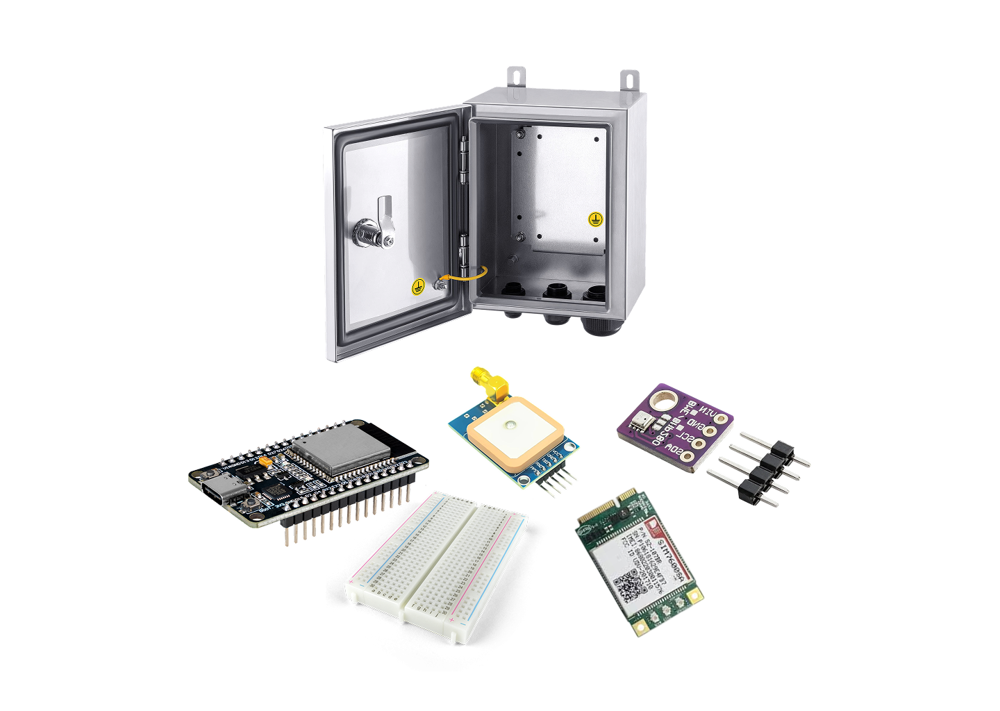

# Thermora Sensor Firmware

ESP32 firmware for Thermora, an IoT system that measures temperature, humidity, and pressure every 600 meters on buses and sends data to a cloud API. This project focuses on climate justice by mapping heat distribution in urban peripheries.

## Hardware



- ESP32 DevKit V1 (~R$ 35,00)
- BME280 Sensor (~R$ 15,00)
- NEO-6M GPS Module (~R$ 25,00)
- LEDs, resistors, breadboard (~R$ 15,00)
- Power supply, enclosure (~R$ 35,00)

**Total: ~R$ 123,00**

## Libraries

Install via Arduino IDE Library Manager:

- Adafruit BME280 Library (install "Adafruit Unified Sensor" dependency)
- TinyGPS++ (by Mikal Hart)
- ArduinoJson (version 6.x)

## Setup

1. Install ESP32 board support in Arduino IDE
2. Install libraries above
3. Configure `config.h`:
   - WiFi SSID and password
   - API endpoint and key
   - Bus ID
4. Upload `thermora-sensor.ino` to ESP32

## Configuration

Edit `config.h`:

```cpp
#define WIFI_SSID "YOUR_WIFI_SSID"
#define WIFI_PASSWORD "YOUR_WIFI_PASSWORD"
#define API_ENDPOINT "https://api.thermora.example.com/v1/readings"
#define API_KEY "YOUR_API_KEY_HERE"
#define BUS_ID "BUS_001"
```

## Operation

System measures environmental data every 600 meters along bus route and sends to cloud API. LED indicators show status:
- Power: ON when powered
- WiFi: ON when connected, blinking when connecting
- GPS: ON when fix acquired, blinking when searching
- Error: Blinking on failures

## Documentation

- `HARDWARE.md` - Wiring and assembly guide
- `API.md` - API endpoint documentation

## License

MIT License

